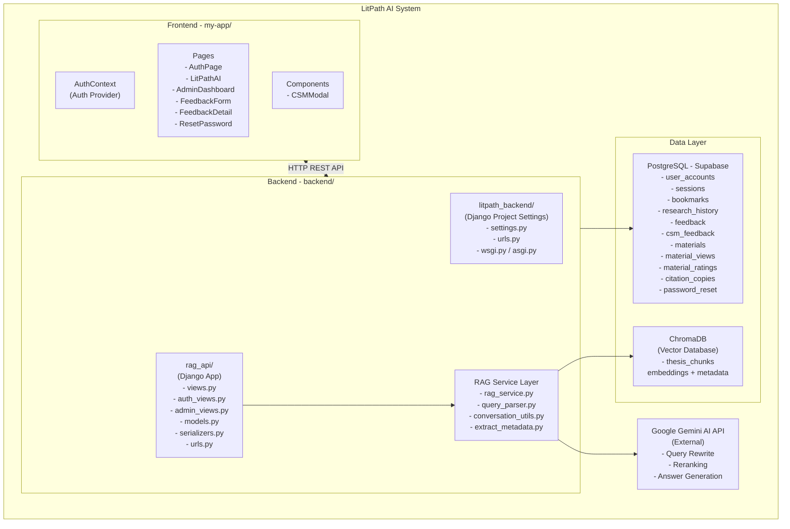
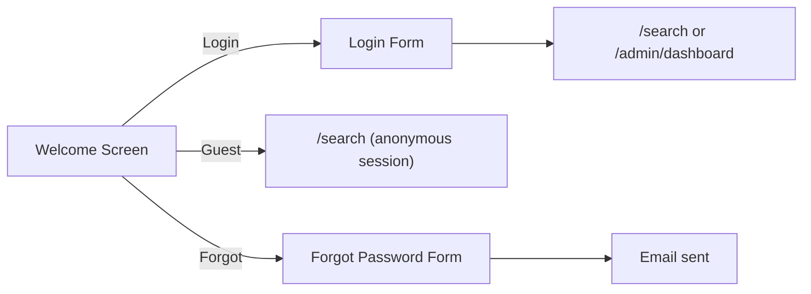
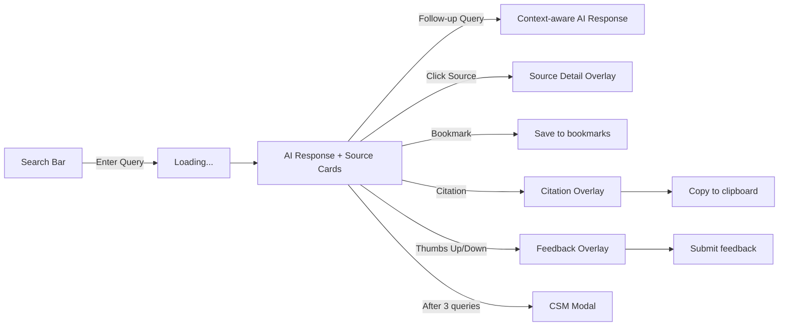
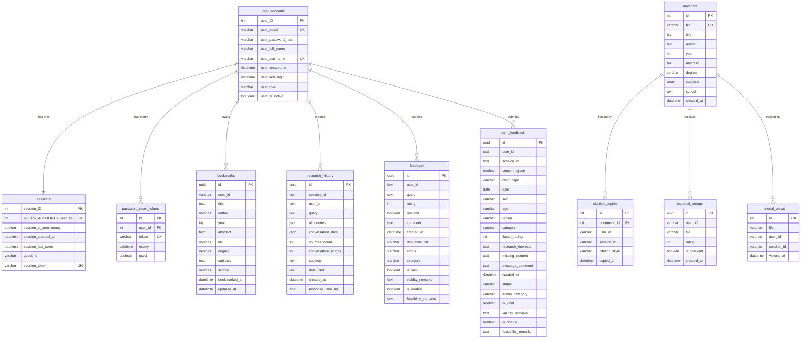
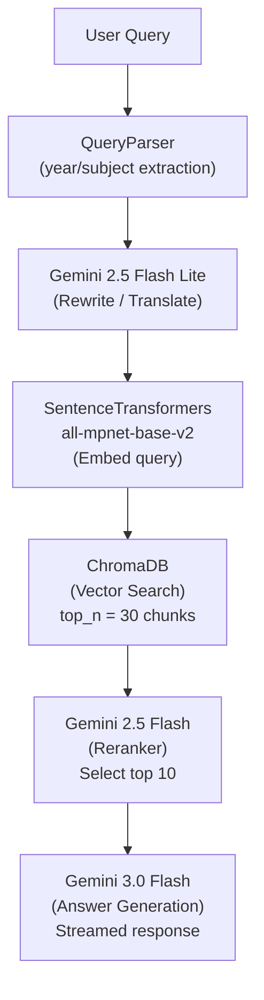

# **Software Design Specification**

# **for**

# **LitPath AI — AI-Powered Thesis Search System**

**Version 1.0 approved — February 26, 2026**

**Prepared by:**

- **Jenine Elaine Dulay** — Project Lead
- **Tracie Tomon** — QA Tester
- **Charijoy Cempron** — Developer
- **Marielle Kloie Concepcion** — Developer

---

## **1. INTRODUCTION**

### **1.1 Purpose of the Document**

This Software Design Specification (SDS) document provides a comprehensive description of the design and architecture of the **LitPath AI — AI-Powered Thesis Search System**. It serves as a technical reference for the development team, stakeholders, and future maintainers by detailing the system architecture, database schema, user interface design, and process interfaces.

The document is intended to:

- Communicate the system design to all members of the PBL team and project stakeholders.
- Serve as a blueprint for implementation, testing, and maintenance.
- Define the structural and behavioral aspects of each module and component within the system.
- Provide a traceable mapping from system requirements to design artifacts.

### **1.2 Scope of the System**

**LitPath AI** is a web-based, AI-powered academic thesis search and discovery system developed for the **Department of Science and Technology — Science and Technology Information Institute (DOST-STII)** thesis repository. The system enables users to perform AI-powered semantic searches over a curated collection of theses and dissertations, leveraging a **Retrieval-Augmented Generation (RAG)** pipeline.

**In-Scope:**

- AI-powered semantic search over thesis documents using vector embeddings and a ChromaDB vector database.
- Natural language query understanding with LLM-based query rewriting (Google Gemini AI).
- AI-generated summaries from relevant thesis sources.
- Template-based citation generation (APA, MLA, Chicago, IEEE, Harvard) using structured metadata — no AI is used for citations.
- User authentication system with role-based access control (Guest, User, Staff, Admin).
- Bookmarking, research history tracking, and citation generation (APA, MLA, Chicago, IEEE, Harvard).
- Librarian/Admin dashboard with analytics: KPIs, trending topics, material ratings, feedback triage, usage analytics, and citation tracking.
- Client Satisfaction Measurement (CSM) feedback system aligned with government standards.
- Material view tracking, most/least browsed materials, and dormant document detection.
- Password reset via email (SMTP).

**Out-of-Scope:**

- Full-text PDF viewing/download within the application.
- Integration with external academic databases (Scopus, Web of Science, etc.).
- Offline mode or local-only deployment without internet access (Gemini API requires connectivity).

### **1.3 Overview of the Document**

This document is organized into four major sections:

- **Section 1 — Introduction:** Provides the purpose, scope, and project overview.
- **Section 2 — Preliminary Design:** Describes the high-level system architecture, including the package diagram and design class diagram.
- **Section 3 — Detailed Design:** Covers the graphical user interface screens, the physical database schema (ERD), and the complete data dictionary for all tables.
- **Section 4 — Interface Design:** Details each API process interface (RESTful endpoints), including request/response specifications and module descriptions.

### **1.4 Project Overview**

**LitPath AI** (version 1.0) is an AI-powered thesis search system that makes the DOST-STII thesis collection accessible through conversational, AI-powered search. It replaces traditional keyword-only search with a **Retrieval-Augmented Generation (RAG)** approach that understands natural language queries — including queries in Filipino/Tagalog/Taglish — and returns synthesized, citation-backed answers.

**Key capabilities:**

| Feature | Description |
|---|---|
| Semantic Search | Uses SentenceTransformers (`all-mpnet-base-v2`) embeddings stored in ChromaDB to find relevant thesis chunks by meaning, not just keywords. |
| LLM Query Rewriting | Google Gemini 2.5 Flash Lite rewrites/translates user queries for optimal retrieval. |
| LLM-based Reranking | Gemini 2.5 Flash reranks retrieved chunks for precision before generating answers. |
| AI Answer Generation | Gemini 3.0 Flash generates comprehensive, citation-backed research summaries via streaming. |
| Conversational Follow-ups | Pronoun resolution and entity tracking maintain context across multi-turn conversations. |
| Metadata Filters | Natural language parsing extracts year ranges and subject filters from queries automatically. |
| 37 Subject Categories | Controlled vocabulary for subject classification (Agriculture, Biology, Computer Science, etc.). |
| Role-Based Access | Four roles: Guest, User, Staff, Admin — each with distinct permissions. |
| Admin Dashboard | Comprehensive analytics for librarians including KPIs, trending topics, citation stats, and feedback triage. |
| CSM Feedback | Government-standard Client Satisfaction Measurement survey with demographics. |

**Limitations and Disclaimers:**

- The system's AI-generated summaries are based solely on the indexed thesis collection and do not access external sources.
- Accuracy of metadata extraction (title, author, degree, subjects) depends on the formatting consistency of the source thesis documents.
- The system requires a valid Google Gemini API key for AI features; without it, only basic vector search is available.
- The current deployment is designed for a single institutional repository (DOST-STII).

**Technology Stack:**

| Layer | Technology |
|---|---|
| Frontend | React 19, Vite 7, Tailwind CSS 3, React Router 7, Lucide React Icons, Chart.js |
| Backend | Django 5.0, Django REST Framework, Python 3.10+ |
| Database | PostgreSQL (Supabase) |
| Vector Database | ChromaDB (persistent, on-disk) |
| AI/ML | Google Gemini AI (2.5 Flash Lite, 2.5 Flash, 3.0 Flash), SentenceTransformers (`all-mpnet-base-v2`) |
| PDF Processing | PyPDF2, Tesseract OCR (fallback) |
| Email | Django SMTP (Gmail) |
| Auth | Custom token-based authentication — on login, the server generates a cryptographic token via `secrets.token_urlsafe(32)`, stores it in the `sessions` table, and returns it to the client. The frontend stores this token in `localStorage` and includes it as a `Bearer` token in the `Authorization` HTTP header for all authenticated requests. The backend validates the token by looking it up in the `sessions` table. Sessions expire after 24 hours of inactivity. Each user can only have one active session at a time (creating a new session deletes the previous one). Guest users receive an anonymous session token with the same mechanism but without an associated `user_accounts` record. |

---

## **2. PRELIMINARY DESIGN**

### **2.1 System Architecture**

The LitPath AI system follows a **three-tier client-server architecture** with a dedicated RAG (Retrieval-Augmented Generation) pipeline layer.

#### **2.1.1 Package Diagram**



#### **2.1.2 Design Class Diagram**

```mermaid
classDiagram
    class UserRole {
        <<enumeration>>
        GUEST = guest
        USER = user
        STAFF = staff
        ADMIN = admin
    }

    class UserAccount {
        -id : AutoField PK
        -email : EmailField unique
        -password_hash : CharField 200
        -full_name : CharField 100
        -username : CharField 50 unique
        -created_at : DateTimeField
        -last_login : DateTimeField
        -role : CharField UserRole
        -is_active : BooleanField
        +set_password(raw_password)
        +check_password(raw_password) bool
        +update_last_login()
        +is_staff_or_admin() bool
    }

    class Session {
        -id : AutoField PK
        -is_anonymous : BooleanField
        -created_at : DateTimeField
        -last_seen : DateTimeField
        -user : OneToOneField UserAccount
        -guest_id : CharField 100
        -session_token : CharField 255 unique
        +is_expired(hours) bool
        +update_activity()
        +create_for_user(user) Session
        +create_guest_session() Session
    }

    class PasswordResetToken {
        -id : AutoField PK
        -user : ForeignKey UserAccount
        -token : CharField 128 unique
        -expiry : DateTimeField
        -used : BooleanField
    }

    class Bookmark {
        -id : UUIDField PK
        -user_id : CharField 255
        -title : TextField
        -author : CharField 500
        -year : IntegerField
        -abstract : TextField
        -file : CharField 500
        -degree : CharField 200
        -subjects : TextField
        -school : CharField 500
        -bookmarked_at : DateTimeField
        -updated_at : DateTimeField
    }

    class ResearchHistory {
        -id : UUIDField PK
        -session_id : TextField
        -user_id : TextField
        -query : TextField
        -all_queries : JSONField
        -conversation_data : JSONField
        -sources_count : IntegerField
        -conversation_length : IntegerField
        -subjects : TextField
        -date_filter : TextField
        -created_at : DateTimeField
        -response_time_ms : FloatField
    }

    class Feedback {
        -id : UUIDField PK
        -user_id : TextField
        -query : TextField
        -rating : IntegerField
        -relevant : BooleanField
        -comment : TextField
        -created_at : DateTimeField
        -document_file : CharField 500
        -status : CharField 20
        -category : CharField 50
        -is_valid : BooleanField
        -validity_remarks : TextField
        -is_doable : BooleanField
        -feasibility_remarks : TextField
    }

    class Material {
        -id : AutoField PK
        -file : CharField 500 unique
        -title : TextField
        -author : TextField
        -year : IntegerField
        -abstract : TextField
        -degree : CharField 100
        -subjects : ArrayField
        -school : TextField
        -created_at : DateTimeField
    }

    class MaterialView {
        -id : AutoField PK
        -file : CharField 500
        -user_id : CharField 100
        -session_id : CharField 100
        -viewed_at : DateTimeField
    }

    class MaterialRating {
        -id : UUIDField PK
        -user_id : CharField 255
        -file : CharField 500
        -rating : IntegerField 1-5
        -is_relevant : BooleanField
        -created_at : DateTimeField
    }

    class CitationCopy {
        -id : AutoField PK
        -document : ForeignKey Material
        -user_id : CharField 100
        -session_id : CharField 100
        -citation_style : CharField 50
        -copied_at : DateTimeField
    }

    class CSMFeedback {
        -id : UUIDField PK
        -user_id : TextField
        -session_id : TextField
        -consent_given : BooleanField
        -client_type : CharField 50
        -date : DateField
        -sex : CharField 50
        -age : CharField 50
        -region : CharField 50
        -category : CharField 100
        -litpath_rating : IntegerField 1-5
        -research_interests : TextField
        -missing_content : TextField
        -message_comment : TextField
        -created_at : DateTimeField
        -status : CharField 20
        -admin_category : CharField 100
        -is_valid : BooleanField
        -validity_remarks : TextField
        -is_doable : BooleanField
        -feasibility_remarks : TextField
    }

    class RAGService {
        <<singleton>>
        -_instance : RAGService
        -_initialized : bool
        -embedder : SentenceTransformer
        -chroma_client : ChromaDB
        -collection : Collection
        -api_key : string
        +initialize()
        +search(question, ...) list
        +embed_chunks(chunks) list
        +sentence_chunking(text) list
        +generate_answer(...) str
        +get_available_filters() dict
        +get_health_status() dict
        +index_txt_files_directly()
        +extract_and_chunk_pdfs()
        +recover_chromadb_from_index()
    }

    class QueryParser {
        -subject_keywords : dict
        -keyword_to_subject : dict
        -current_year : int
        +parse_query(query) dict
        +_extract_year_filters() dict
        +_extract_subject_filters() list
        +_clean_query() string
    }

    class ConversationManager {
        -stop_words : set
        -pronouns : set
        -reference_phrases : list
        +extract_entities(text) list
        +resolve_pronouns(query, context) string
        +is_follow_up(query) bool
    }

    UserAccount --> UserRole : uses
    UserAccount "1" -- "1" Session : has
    UserAccount "1" -- "0..*" PasswordResetToken : has
    UserAccount "1" -- "0..*" Bookmark : owns
    UserAccount "1" -- "0..*" ResearchHistory : creates
    UserAccount "1" -- "0..*" Feedback : submits
    UserAccount "1" -- "0..*" CSMFeedback : submits
    Material "1" -- "0..*" CitationCopy : has
    Material "1" -- "0..*" MaterialRating : receives
    Material "1" -- "0..*" MaterialView : tracked by
    RAGService --> QueryParser : uses
    RAGService --> ConversationManager : uses
```



#### **2.1.3 Architectural Overview**

The system operates through the following flow:

1. **Client Layer (React SPA):** The user interacts with the React frontend served by Vite. All API calls are made to `http://localhost:8000/api/` via `fetch()`.

2. **API Layer (Django REST Framework):** Incoming HTTP requests are routed through `litpath_backend/urls.py` → `rag_api/urls.py` to the appropriate view functions/classes. CORS is handled by `django-cors-headers`.

3. **Authentication Layer:** Session-based token authentication. On login/guest-session, a unique `session_token` is generated and stored in the `sessions` table. The frontend stores this in `localStorage` and includes it in headers for authenticated requests.

4. **RAG Pipeline (Singleton Service):**
   - **Query Parsing:** `QueryParser` extracts year and subject filters from natural language.
   - **Query Rewriting:** Google Gemini 2.5 Flash Lite rewrites/translates the query.
   - **Embedding:** `SentenceTransformers (all-mpnet-base-v2)` encodes the query into a 768-dimensional vector.
   - **Vector Search:** ChromaDB performs cosine similarity search over pre-indexed thesis chunks.
   - **Reranking:** Gemini 2.5 Flash reranks top candidates for relevance.
   - **Answer Generation:** Gemini 3.0 Flash generates a streamed, citation-backed summary.
   - **Conversation Context:** `ConversationManager` tracks entities and resolves pronouns for follow-up queries.

5. **Data Layer:**
   - **PostgreSQL (Supabase):** Stores user accounts, sessions, bookmarks, research history, feedback, materials, ratings, and citations.
   - **ChromaDB:** Stores vector embeddings and metadata for thesis chunks in the `thesis_chunks` collection.
   - **File System:** Thesis `.txt` / `.pdf` files stored in `RAG/theses/`.

---

## **3. DETAILED DESIGN**

### **3.1 Graphical User Interface**

The LitPath AI user interface is a single-page application (SPA) built with React and styled with Tailwind CSS. Below are the major screens and their descriptions.

#### **3.1.1 Authentication Page (`AuthPage.jsx`)**

| Element | Description |
|---|---|
| **Welcome Screen** | Landing page with DOST branding, system introduction, and two entry points: "Login" and "Continue as Guest". |
| **Login Form** | Email + password fields, "Forgot Password" link, show/hide password toggle. On success: redirects to `/search` (users) or `/admin/dashboard` (staff/admin). |
| **Forgot Password** | Email input field, sends password reset link via SMTP email. |
| **Guest Access** | Creates an anonymous session with limited features (no bookmarks persistence across sessions). |

**User Flow:**


#### **3.1.2 Main Search Page (`LitPathAI.jsx`)**

| Element | Description |
|---|---|
| **Header Bar** | DOST-STII logo, "LitPath AI" title, user menu (profile, account settings, logout), bookmarks icon with count badge. |
| **Search Bar** | Central text input with autocomplete example questions. Supports natural language queries. |
| **Most Browsed Carousel** | Horizontal slider showing top 5 most-viewed thesis materials with title, author, year, and view count. |
| **Conversation Panel** | Chat-style interface showing user queries and AI-generated responses. Includes thumbs-up/thumbs-down feedback buttons. |
| **Source Cards** | Expandable cards for each cited thesis source showing: title, author(s), year, degree, school, abstract preview, subjects, and star rating. |
| **Citation Overlay** | Modal for generating citations in APA, MLA, Chicago, IEEE, or Harvard format with copy-to-clipboard. Citations are generated client-side using template-based string formatting from thesis metadata (no AI is used). |
| **Bookmark Overlay** | Side panel listing saved bookmarks with delete capability. |
| **Research History Sidebar** | Collapsible sidebar showing past research sessions. Click to restore a previous conversation. |
| **Account Settings Modal** | Tabs for Profile (edit name, username) and Security (change password). |
| **CSM Feedback Modal** | Government-standard satisfaction survey triggered after 3 queries (24-hour cooldown). |
| **Feedback Overlay** | Quick feedback form with thumbs-up/thumbs-down, comment text area, and submit button. |

**User Flow:**


#### **3.1.3 Admin Dashboard (`AdminDashboard.jsx`)**

| Element | Description |
|---|---|
| **Sidebar Navigation** | Collapsible sidebar with tabs: Overview, Feedback Manager, CSM Feedback, Material Ratings, Account Settings. |
| **Date Range Filter** | Global filter: Year, Month, Last 7 Days, Custom Range. Applies to all dashboard data. |
| **KPI Cards** | Total Documents, Total Searches, Accessed Documents, Utilization %, Failed Queries, Avg Response Time. |
| **Trending Topics Chart** | Bar chart of most searched topics over the selected period. |
| **Top Theses Table** | Table of most-viewed materials with title, author, view count. |
| **Least Browsed / Dormant** | Count of materials with zero views (dormant) and least-browsed list. |
| **Activity Trends Chart** | Line chart of search activity by monthly/weekly/daily granularity. |
| **Usage by Category** | Pie/bar chart of CSM respondent categories (Student, Researcher, etc.). |
| **Age Distribution Chart** | Bar chart of CSM respondent age brackets. |
| **Citation Statistics** | Total citation copies, top-cited materials, citation trends over time. |
| **Feedback Manager Tab** | Filterable table of user feedback. Each row shows: query, rating, comment, status, category. Click to open detail for triage (set status, validity, feasibility, remarks). |
| **CSM Feedback Tab** | Filterable table of CSM survey responses with admin triage fields. |
| **Material Ratings Tab** | List of materials with average ratings, individual user ratings. |

#### **3.1.4 Feedback Form Page (`FeedbackForm.jsx`)**

| Element | Description |
|---|---|
| **CSM Survey Form** | Full-page Client Satisfaction Measurement form with: Data Privacy consent checkbox, Client Profile (type, date, sex, age, region, category), Feedback & Evaluation (1-5 star rating, research interests, missing content, general comments). |
| **Validation** | Required fields: consent, client type, date, sex, age, region, category. Rating is optional. |
| **Submission** | POST to `/api/csm-feedback/` + duplicate write to Supabase `general_feedback` table. |

#### **3.1.5 Reset Password Page (`ResetPassword.jsx`)**

| Element | Description |
|---|---|
| **Reset Form** | Token-based password reset. Fields: New Password (min 8 chars), Confirm Password. Validates token from URL parameter. |
| **Success Flow** | On success, shows confirmation message and redirects to login after 2 seconds. |

---

### **3.2 Schema Design Diagram**

The following Entity-Relationship Diagram (ERD) represents the physical database schema:



**ChromaDB Collection: `thesis_chunks`** (Vector Database — not in PostgreSQL):

| Field | Type | Description |
|---|---|---|
| id | string | Chunk identifier, e.g. `filename.txt_chunk_0` |
| embedding | float[768] | L2-normalized vector from `all-mpnet-base-v2` |
| document | string | Raw chunk text (~500 words) |
| metadata.file | string | Source thesis filename |
| metadata.title | string | Thesis title |
| metadata.author | string | Thesis author |
| metadata.publication_year | string | Publication year |
| metadata.degree | string | Academic degree |
| metadata.university | string | Issuing university |
| metadata.subjects | string | Comma-separated subjects |
| metadata.chunk_idx | integer | Position index within document |

**Relationships:**

| Relationship | Type | Description |
|---|---|---|
| `user_accounts` → `sessions` | One-to-One | Each user can have exactly one active session at a time. |
| `user_accounts` → `password_reset_tokens` | One-to-Many | A user can have multiple reset tokens (only latest is valid). |
| `materials` → `citation_copies` | One-to-Many | Each material can have multiple citation copy records. |
| `materials` → `material_ratings` | One-to-Many | Each user can rate each material once (unique user+file). |
| `bookmarks.user_id` → `user_accounts.id` | Logical FK | User bookmarks (unique per user+file). |
| `research_history.user_id` → `user_accounts.id` | Logical FK | Tracks all search sessions per user. |
| `feedback.user_id` → `user_accounts.id` | Logical FK | Links feedback to users. |
| `csm_feedback.user_id` → `user_accounts.id` | Logical FK | Links CSM surveys to users. |

---

### **3.3 Data Dictionary**

#### **Table: `user_accounts`**

| Data Element Name | User Defined Name | Definition | Data Type | Format/Length | Synonyms |
|---|---|---|---|---|---|
| user_ID | User ID | Auto-incrementing primary key | AutoField | Integer | id, PK |
| user_email | Email Address | User's email, must be unique | EmailField | VARCHAR(50) | email |
| user_password_hash | Password Hash | Bcrypt-hashed password | CharField | VARCHAR(200) | password |
| user_full_name | Full Name | User's display name | CharField | VARCHAR(100), nullable | full_name |
| user_username | Username | Unique login username | CharField | VARCHAR(50) | username |
| user_created_at | Created At | Account creation timestamp | DateTimeField | ISO 8601 | created_at |
| user_last_login | Last Login | Most recent login timestamp | DateTimeField | ISO 8601, nullable | last_login |
| user_role | Role | User access level | CharField | VARCHAR(50) | role |
| user_is_active | Is Active | Account active status | BooleanField | Boolean | is_active |

**Specifications:** `user_role` must be one of: `'guest'`, `'user'`, `'staff'`, `'admin'`. Default is `'user'`. Password hash is generated using Django's `make_password()` (PBKDF2 by default).

---

#### **Table: `sessions`**

| Data Element Name | User Defined Name | Definition | Data Type | Format/Length | Synonyms |
|---|---|---|---|---|---|
| session_ID | Session ID | Auto-incrementing primary key | AutoField | Integer | id, PK |
| session_is_anonymous | Is Anonymous | Whether this is a guest session | BooleanField | Boolean | is_anonymous |
| session_created_at | Created At | Session creation timestamp | DateTimeField | ISO 8601 | created_at |
| session_last_seen | Last Seen | Last activity timestamp | DateTimeField | ISO 8601 | last_seen |
| USERS_ACCOUNTS_user_ID | User FK | Foreign key to user_accounts | OneToOneField | Integer, nullable | user_id |
| guest_id | Guest ID | Unique identifier for anonymous sessions | CharField | VARCHAR(100), nullable | — |
| session_token | Session Token | Cryptographic session token | CharField | VARCHAR(255), unique | token |

**Specifications:** `session_token` is generated using Python `secrets.token_urlsafe(32)`. Sessions expire after 24 hours of inactivity. Creating a new session for a user deletes any existing session (enforcing one-to-one).

---

#### **Table: `bookmarks`**

| Data Element Name | User Defined Name | Definition | Data Type | Format/Length | Synonyms |
|---|---|---|---|---|---|
| id | Bookmark ID | UUID primary key | UUIDField | UUID v4 | PK |
| user_id | User ID | Owner of the bookmark | CharField | VARCHAR(255) | — |
| title | Title | Thesis title | TextField | Unlimited | — |
| author | Author | Thesis author(s) | CharField | VARCHAR(500), nullable | — |
| year | Year | Publication year | IntegerField | Integer, nullable | — |
| abstract | Abstract | Thesis abstract text | TextField | Unlimited, nullable | — |
| file | File | Source filename reference | CharField | VARCHAR(500) | — |
| degree | Degree | Academic degree | CharField | VARCHAR(200), nullable | — |
| subjects | Subjects | Subject categories | TextField | Unlimited, nullable | — |
| school | School | University/Institution | CharField | VARCHAR(500), nullable | — |
| bookmarked_at | Bookmarked At | Timestamp of bookmark creation | DateTimeField | ISO 8601 | — |
| updated_at | Updated At | Last update timestamp | DateTimeField | ISO 8601 | — |

**Specifications:** Unique constraint on `(user_id, file)` prevents duplicate bookmarks.

---

#### **Table: `research_history`**

| Data Element Name | User Defined Name | Definition | Data Type | Format/Length | Synonyms |
|---|---|---|---|---|---|
| id | History ID | UUID primary key | UUIDField | UUID v4 | PK |
| session_id | Session ID | Conversation session identifier | TextField | Unlimited | — |
| user_id | User ID | User who initiated the search | TextField | Unlimited | — |
| query | Query | Initial search query text | TextField | Unlimited | — |
| all_queries | All Queries | JSON array of all queries in session | JSONField | JSON, nullable | — |
| conversation_data | Conversation Data | Full Q&A conversation in JSON | JSONField | JSON, nullable | — |
| sources_count | Sources Count | Number of sources found | IntegerField | Integer, nullable | — |
| conversation_length | Conversation Length | Number of turns in conversation | IntegerField | Integer, nullable | — |
| subjects | Subjects | Subject filters applied | TextField | Unlimited, nullable | — |
| date_filter | Date Filter | Date/year filter applied | TextField | Unlimited, nullable | — |
| created_at | Created At | Record creation timestamp | DateTimeField | ISO 8601 | — |
| response_time_ms | Response Time | Query response time in milliseconds | FloatField | Float, nullable | — |

**Specifications:** `sources_count = 0` indicates a "failed query" (no results found), used for the Failed Queries KPI on the admin dashboard.

---

#### **Table: `feedback`**

| Data Element Name | User Defined Name | Definition | Data Type | Format/Length | Synonyms |
|---|---|---|---|---|---|
| id | Feedback ID | UUID primary key | UUIDField | UUID v4 | PK |
| user_id | User ID | User who submitted feedback | TextField | Unlimited | — |
| query | Query | The search query being rated | TextField | Unlimited, nullable | — |
| rating | Rating | Numeric quality rating | IntegerField | Integer, nullable | — |
| relevant | Relevant | Was the result relevant? | BooleanField | Boolean, nullable | — |
| comment | Comment | Free-text feedback comment | TextField | Unlimited, nullable | — |
| created_at | Created At | Submission timestamp | DateTimeField | ISO 8601 | — |
| document_file | Document File | Specific file being rated | CharField | VARCHAR(500), nullable | — |
| status | Status | Admin triage status | CharField | VARCHAR(20) | — |
| category | Category | Admin classification | CharField | VARCHAR(50), nullable | — |
| is_valid | Is Valid | Validity check by admin | BooleanField | Boolean, nullable | — |
| validity_remarks | Validity Remarks | Admin notes on validity | TextField | Unlimited, nullable | — |
| is_doable | Is Doable | Feasibility check by admin | BooleanField | Boolean, nullable | — |
| feasibility_remarks | Feasibility Remarks | Admin notes on feasibility | TextField | Unlimited, nullable | — |

**Specifications:** `status` is one of: `'Pending'`, `'Reviewed'`, `'Resolved'`. `category` is one of: `'Positive'`, `'Issue'`, `'For Improvement'`.

---

#### **Table: `csm_feedback`**

| Data Element Name | User Defined Name | Definition | Data Type | Format/Length | Synonyms |
|---|---|---|---|---|---|
| id | CSM ID | UUID primary key | UUIDField | UUID v4 | PK |
| user_id | User ID | Respondent user identifier | TextField | Unlimited | — |
| session_id | Session ID | User's session identifier | TextField | Unlimited, nullable | — |
| consent_given | Consent Given | Data privacy consent | BooleanField | Boolean | — |
| client_type | Client Type | Citizen/Business/Government | CharField | VARCHAR(50) | — |
| date | Date | Survey date | DateField | YYYY-MM-DD | — |
| sex | Sex | Female/Male/Prefer not to say | CharField | VARCHAR(50) | — |
| age | Age | Age bracket | CharField | VARCHAR(50) | — |
| region | Region | Philippine region code | CharField | VARCHAR(50) | — |
| category | Category | Respondent category | CharField | VARCHAR(100) | — |
| litpath_rating | LitPath Rating | Satisfaction rating (1-5) | IntegerField | Integer, nullable | — |
| research_interests | Research Interests | Free-text research interests | TextField | Unlimited, nullable | — |
| missing_content | Missing Content | Content gaps identified | TextField | Unlimited, nullable | — |
| message_comment | Message/Comment | General feedback comment | TextField | Unlimited, nullable | — |
| created_at | Created At | Record creation timestamp | DateTimeField | ISO 8601 | — |
| status | Status | Admin triage status | CharField | VARCHAR(20) | — |
| admin_category | Admin Category | Admin classification label | CharField | VARCHAR(100), nullable | — |
| is_valid | Is Valid | Validity assessment | BooleanField | Boolean, nullable | — |
| validity_remarks | Validity Remarks | Admin validity notes | TextField | Unlimited, nullable | — |
| is_doable | Is Doable | Feasibility assessment | BooleanField | Boolean, nullable | — |
| feasibility_remarks | Feasibility Remarks | Admin feasibility notes | TextField | Unlimited, nullable | — |

**Specifications:** `client_type`: `'Citizen'` | `'Business'` | `'Government'`. `age` brackets: `'10 and below'` through `'61 and above'`. `region`: Philippine standard region codes (`'NCR'`, `'CAR'`, `'R01'`–`'R13'`, `'BARMM'`, `'N/A'`). `category`: `'Student'` | `'DOST Employee'` | `'Other Government Employee'` | `'Librarian/Library Staff'` | `'Teaching Personnel'` | `'Administrative Personnel'` | `'Researcher'`.

---

#### **Table: `materials`**

| Data Element Name | User Defined Name | Definition | Data Type | Format/Length | Synonyms |
|---|---|---|---|---|---|
| id | Material ID | Auto-incrementing primary key | AutoField | Integer | PK |
| file | File | Source filename (unique) | CharField | VARCHAR(500) | — |
| title | Title | Thesis title | TextField | Unlimited | — |
| author | Author | Author name(s) | TextField | Unlimited | — |
| year | Year | Publication year | IntegerField | Integer, nullable | — |
| abstract | Abstract | Thesis abstract | TextField | Unlimited | — |
| degree | Degree | Academic degree | CharField | VARCHAR(100) | — |
| subjects | Subjects | Subject categories array | ArrayField(CharField) | Array of VARCHAR(200) | — |
| school | School | University/Institution | TextField | Unlimited | — |
| created_at | Created At | Record creation timestamp | DateTimeField | ISO 8601 | — |

---

#### **Table: `material_views`**

| Data Element Name | User Defined Name | Definition | Data Type | Format/Length | Synonyms |
|---|---|---|---|---|---|
| id | View ID | Auto-incrementing primary key | AutoField | Integer | PK |
| file | File | Filename of viewed material | CharField | VARCHAR(500) | — |
| user_id | User ID | Viewer's user ID | CharField | VARCHAR(100), nullable | — |
| session_id | Session ID | Viewer's session ID | CharField | VARCHAR(100), nullable | — |
| viewed_at | Viewed At | View timestamp | DateTimeField | ISO 8601 | — |

---

#### **Table: `material_ratings`**

| Data Element Name | User Defined Name | Definition | Data Type | Format/Length | Synonyms |
|---|---|---|---|---|---|
| id | Rating ID | UUID primary key | UUIDField | UUID v4 | PK |
| user_id | User ID | Rater's user ID | CharField | VARCHAR(255) | — |
| file | File | Rated material filename | CharField | VARCHAR(500) | — |
| rating | Rating | Star rating (1-5) | IntegerField | Integer | — |
| is_relevant | Is Relevant | Relevance to query | BooleanField | Boolean | — |
| created_at | Created At | Rating timestamp | DateTimeField | ISO 8601 | — |

**Specifications:** Unique constraint on `(user_id, file)` — one rating per user per material.

---

#### **Table: `citation_copies`**

| Data Element Name | User Defined Name | Definition | Data Type | Format/Length | Synonyms |
|---|---|---|---|---|---|
| id | Citation ID | Auto-incrementing primary key | AutoField | Integer | PK |
| document_id | Document FK | Foreign key to materials table | ForeignKey | Integer | — |
| user_id | User ID | User who copied | CharField | VARCHAR(100), nullable | — |
| session_id | Session ID | Session of the copy event | CharField | VARCHAR(100), nullable | — |
| citation_style | Citation Style | Format used (APA/MLA/etc.) | CharField | VARCHAR(50) | — |
| copied_at | Copied At | Copy event timestamp | DateTimeField | ISO 8601 | — |

**Specifications:** `citation_style` is one of: `'APA'`, `'MLA'`, `'Chicago'`, `'IEEE'`, `'Harvard'`.

---

#### **Table: `password_reset_tokens` (PasswordResetToken)**

| Data Element Name | User Defined Name | Definition | Data Type | Format/Length | Synonyms |
|---|---|---|---|---|---|
| id | Token ID | Auto-incrementing primary key | AutoField | Integer | PK |
| user_id | User FK | Foreign key to user_accounts | ForeignKey | Integer | — |
| token | Token | Unique reset token string | CharField | VARCHAR(128), unique | — |
| expiry | Expiry | Token expiration timestamp | DateTimeField | ISO 8601 | — |
| used | Used | Whether token has been consumed | BooleanField | Boolean | — |

---

#### **ChromaDB Collection: `thesis_chunks`**

| Data Element Name | User Defined Name | Definition | Data Type | Format/Length |
|---|---|---|---|---|
| id | Chunk ID | Unique chunk identifier | String | `{filename}_chunk_{index}` |
| embedding | Vector Embedding | 768-dimensional embedding vector | float[768] | L2-normalized |
| document | Chunk Text | Raw text of the thesis chunk | String | ~500 words per chunk |
| metadata.file | File | Source thesis filename | String | — |
| metadata.title | Title | Thesis title | String | — |
| metadata.author | Author | Thesis author | String | — |
| metadata.publication_year | Publication Year | Publication year | String | — |
| metadata.degree | Degree | Academic degree | String | — |
| metadata.university | University | Issuing university | String | — |
| metadata.subjects | Subjects | Comma-separated subjects | String | — |
| metadata.chunk_idx | Chunk Index | Position index within document | Integer | — |

**Specifications:** Embeddings are generated by `SentenceTransformers all-mpnet-base-v2` and L2-normalized. Chunks are created using sentence-based chunking with 500-word windows and 20% overlap. Collection uses cosine similarity for search. Distance threshold: 1.5 (values below are considered relevant).

---

## **4. INTERFACE DESIGN**

### **4.1 Process Interface**

All API endpoints are prefixed with `/api/` and served by the Django backend at `http://localhost:8000`. The frontend communicates with the backend via `fetch()` HTTP requests using JSON payloads.

---

#### **4.1.1 Module: Authentication (`auth_views.py`)**

| # | Process Name | Endpoint | Method | Description |
|---|---|---|---|---|
| 1 | User Login | `/api/auth/login/` | POST | Authenticates user with email + password. Returns user object and session token. |
| 2 | User Registration | `/api/auth/register/` | POST | Creates a new user account. Returns user object and session token. |
| 3 | Guest Session | `/api/auth/guest-session/` | POST | Creates an anonymous guest session. Returns guest user object and session token. |
| 4 | Validate Session | `/api/auth/validate-session/` | POST | Checks if a session ID is still valid and not expired. Returns `{valid: bool}`. |
| 5 | Logout | `/api/auth/logout/` | POST | Invalidates the user's session by deleting it from the database. |
| 6 | Delete Guest Data | `/api/auth/delete-guest-data/` | POST | Deletes all data associated with a guest session (bookmarks, history, feedback). |
| 7 | Get Current User | `/api/auth/me/` | GET | Returns current user profile based on session token in Authorization header. |
| 8 | Change Password | `/api/auth/change-password/` | POST | Changes user password. Requires current password verification. |
| 9 | Update Profile | `/api/auth/update-profile/` | POST | Updates user's full_name and/or username. Requires Bearer token. |
| 10 | Password Reset Request | `/api/auth/password-reset-request/` | POST | Sends password reset email link. Always returns success for security. |
| 11 | Reset Password | `/api/auth/reset-password/` | POST | Consumes reset token and sets new password. |

**Sample — Login Request:**
```json
POST /api/auth/login/
{
    "email": "user@example.com",
    "password": "securepassword123"
}
```
**Sample — Login Response:**
```json
{
    "success": true,
    "user": {
        "id": 1,
        "email": "user@example.com",
        "username": "johndoe",
        "full_name": "John Doe",
        "role": "user"
    },
    "session": {
        "session_id": 5,
        "session_token": "abc123...xyz",
        "created_at": "2026-02-26T10:00:00Z",
        "is_anonymous": false
    }
}
```

---

#### **4.1.2 Module: Search & RAG (`views.py` → `rag_service.py`)**

| # | Process Name | Endpoint | Method | Description |
|---|---|---|---|---|
| 1 | Health Check | `/api/health/` | GET | Returns system health: status, document count, chunk count, file counts, RAG initialization state. |
| 2 | Search (Standard) | `/api/search/` | POST | Performs full RAG pipeline: query parsing → rewriting → embedding → vector search → reranking → AI generation. Returns AI answer + source documents. |
| 3 | Search (Streaming) | `/api/search/stream/` | POST | Same as standard search but returns AI answer via Server-Sent Events (SSE) for real-time streaming. |
| 4 | Get Filters | `/api/filters/` | GET | Returns available subject categories and year ranges from the indexed collection. |
| 5 | RAG Evaluation | `/api/evaluate/` | POST | Runs RAG accuracy evaluation benchmark. |

**Sample — Search Request:**
```json
POST /api/search/
{
    "question": "How does climate change affect rice production in the Philippines?",
    "subjects": ["Agriculture"],
    "year_start": "2020",
    "year_end": "2025",
    "conversation_id": "conv_abc123",
    "conversation_history": []
}
```
**Sample — Search Response:**
```json
{
    "answer": "Based on the reviewed theses, climate change significantly impacts rice production...",
    "sources": [
        {
            "title": "Effects of Climate Change on Rice Yield...",
            "author": "Juan Dela Cruz",
            "year": 2022,
            "degree": "Master of Science in Agronomy",
            "school": "University of the Philippines Los Baños",
            "abstract": "This study investigates...",
            "subjects": "Agriculture, Environmental Science",
            "file": "thesis_2022_001.txt",
            "relevance_score": 0.85
        }
    ],
    "query_info": {
        "original": "How does climate change affect rice production...",
        "rewritten": "Impact of climate change on rice production Philippines",
        "filters_applied": {"year_start": "2020", "year_end": "2025", "subjects": ["Agriculture"]}
    }
}
```

**RAG Pipeline Process (Internal):**


---

#### **4.1.3 Module: Bookmarks (`views.py`)**

| # | Process Name | Endpoint | Method | Description |
|---|---|---|---|---|
| 1 | List/Create Bookmarks | `/api/bookmarks/` | GET / POST | GET: Lists all bookmarks for a user. POST: Creates a new bookmark (user_id, file, title, etc.). |
| 2 | Delete Bookmark by ID | `/api/bookmarks/<bookmark_id>/` | DELETE | Deletes a specific bookmark by its database ID. |
| 3 | Delete Bookmark by File | `/api/bookmarks/delete-by-file/` | POST | Deletes a bookmark by matching user_id + file name. |

---

#### **4.1.4 Module: Research History (`views.py`)**

| # | Process Name | Endpoint | Method | Description |
|---|---|---|---|---|
| 1 | List/Create History | `/api/research-history/` | GET / POST | GET: Retrieves user's research sessions. POST: Saves a new research session with conversation data. |
| 2 | Delete History | `/api/research-history/<session_id>/` | DELETE | Deletes a specific research history entry. |

---

#### **4.1.5 Module: Feedback (`views.py`)**

| # | Process Name | Endpoint | Method | Description |
|---|---|---|---|---|
| 1 | List/Create Feedback | `/api/feedback/` | GET / POST | GET: Lists feedback entries (filterable by status, date). POST: Submits new feedback (rating, comment, query). |
| 2 | Feedback Detail | `/api/feedback/<uuid:pk>/` | GET / PUT / PATCH / DELETE | GET: Single feedback detail. PUT/PATCH: Admin updates (status, category, validity, feasibility). DELETE: Remove feedback. |

---

#### **4.1.6 Module: CSM Feedback (`views.py`)**

| # | Process Name | Endpoint | Method | Description |
|---|---|---|---|---|
| 1 | List/Create CSM | `/api/csm-feedback/` | GET / POST | GET: Lists CSM survey responses. POST: Submits new CSM form data (also writes to Supabase `general_feedback` table). |
| 2 | CSM Detail | `/api/csm-feedback/<uuid:pk>/` | GET / PUT / PATCH / DELETE | Admin triage: update status, admin_category, validity, feasibility. |

---

#### **4.1.7 Module: Material Tracking (`views.py`)**

| # | Process Name | Endpoint | Method | Description |
|---|---|---|---|---|
| 1 | Track Material View | `/api/track-view/` | POST | Records a material view event (file, user_id, session_id). |
| 2 | Get Most Browsed | `/api/most-browsed/` | GET | Returns top N most-viewed materials with view counts. |
| 3 | Get Source Ratings | `/api/sources/ratings/` | GET | Returns materials with their average ratings. |
| 4 | Get Material Rating Detail | `/api/materials/rating/` | GET | Returns detailed rating information for a specific material. |
| 5 | Get Sources Stats | `/api/sources/stats/` | GET | Returns aggregate source statistics. |

---

#### **4.1.8 Module: Citation Tracking (`views.py`)**

| # | Process Name | Endpoint | Method | Description |
|---|---|---|---|---|
| 1 | Track Citation Copy | `/api/track-citation/` | POST | Records when a user copies a citation (file, style, user_id, session_id). |

---

#### **4.1.9 Module: Admin Dashboard Analytics (`views.py`)**

| # | Process Name | Endpoint | Method | Description |
|---|---|---|---|---|
| 1 | KPI Summary | `/api/dashboard/kpi/` | GET | Returns key performance indicators: total documents, searches, accessed documents, utilization %, failed queries count, avg response time. |
| 2 | Trending Topics | `/api/dashboard/trending-topics/` | GET | Returns most searched topics/subjects in the given date range. |
| 3 | Failed Queries Count | `/api/dashboard/failed-queries-count/` | GET | Returns count of searches that returned 0 results. |
| 4 | Usage by Category | `/api/dashboard/usage-by-category/` | GET | Returns CSM feedback breakdown by respondent category. |
| 5 | Age Distribution | `/api/dashboard/age-distribution/` | GET | Returns CSM feedback breakdown by age bracket. |
| 6 | Monthly Trends | `/api/dashboard/monthly-trends/` | GET | Returns search activity aggregated by month. |
| 7 | Weekly Trends | `/api/dashboard/weekly-trends/` | GET | Returns search activity aggregated by week. |
| 8 | Daily Trends | `/api/dashboard/daily-trends/` | GET | Returns search activity aggregated by day. |
| 9 | Citation Stats | `/api/dashboard/citation-stats/` | GET | Returns total citation copies and top-cited materials. |
| 10 | Citation Monthly | `/api/dashboard/citation-monthly/` | GET | Citation copy counts by month. |
| 11 | Citation Weekly | `/api/dashboard/citation-weekly/` | GET | Citation copy counts by week. |
| 12 | Citation Daily | `/api/dashboard/citation-daily/` | GET | Citation copy counts by day. |
| 13 | Top Theses | `/api/dashboard/top-theses/` | GET | Returns most-viewed theses. |
| 14 | Least Browsed | `/api/dashboard/least-browsed/` | GET | Returns materials with lowest view counts. |
| 15 | Dormant Count | `/api/dashboard/dormant-count/` | GET | Returns count of materials with zero views. |

---

### **4.2 External Interface Dependencies**

| Interface | Purpose | Protocol | Configuration |
|---|---|---|---|
| Google Gemini AI API | Query rewriting (2.5 Flash Lite), Reranking (2.5 Flash), Answer generation (3.0 Flash) | HTTPS REST | `GEMINI_API_KEY` env variable |
| PostgreSQL (Supabase) | Primary relational database | TCP port 5432 | `DATABASE_URL` env variable or individual `DB_*` variables |
| Gmail SMTP | Password reset emails | SMTP (TLS, port 587) | `EMAIL_HOST_USER`, `EMAIL_HOST_PASSWORD` env variables |
| ChromaDB | Vector similarity search | Local file I/O (persistent) | `RAG_CHROMADB_PATH` setting → `RAG/chromadb_data/` |
| SentenceTransformers | Text-to-vector embedding | Local Python library | Model: `all-mpnet-base-v2` (downloaded on first run) |

---

*End of Software Design Specification for LitPath AI v1.0*
